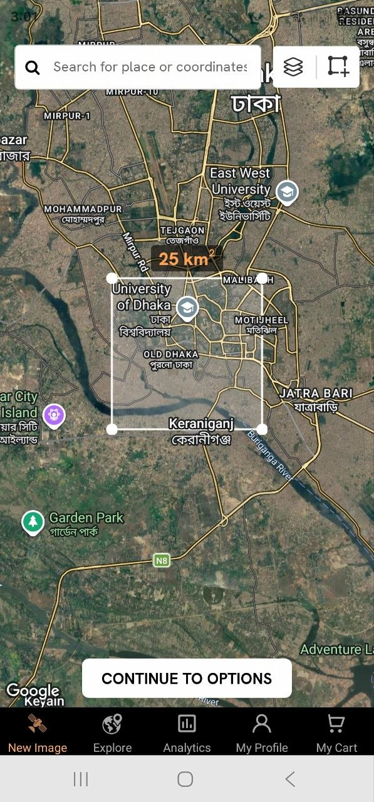

# Ubiquitous Eye — Mobile App (Flutter)

The mobile client for **Ubiquitous Eyes** — a SkyFi-style satellite-imagery
tasking and analytics app. It lives alongside the React web `Frontend/` and the
Flask `server/` in this repo, and is a self-contained Flutter project.



## What's implemented

- **Scrollable world map background** — full pan + pinch-zoom over Esri satellite
  imagery with place labels (toggle to OpenStreetMap streets via the layers
  button). It is *not* a static image.
- **Rectangular area selection** — a white selection box with four corner
  handles you can drag to **resize**, plus a centre handle to **move** it.
  The box stays anchored to the geography while you pan/zoom.
- **Live area readout** — the `… km²` badge on the top edge updates in real
  time (Haversine width × height).
- **Search bar** — type a place name (geocoded via OpenStreetMap Nominatim)
  **or** raw coordinates like `23.78, 90.40`. Tap a result to fly there and
  recentre the selection box.
- **Map controls** — layers toggle (satellite ↔ street) and a reset-box button.
- **Analytics catalog** — brand wordmark, topic filters, a grid of the seven
  services (deforestation, land encroachment, NDVI, …), a favourites store, a
  service detail page, and an image-options step.
- **Adaptive navigation** — a black bottom bar on phones; a left navigation
  rail on tablets / desktop / wide web.
- **Laptop-friendly map controls** — see
  [Desktop & touchpad controls](#desktop--touchpad-controls).
- **Change analysis (backend-connected)** — after choosing an area, run the
  backend change-detection pipeline and see the result on the map: red =
  deforestation, orange = surface-water loss, plus pixel-count stats. See
  [Backend integration](#backend-integration).
- **Land use classification (backend-connected)** — labels every pixel of the
  selected area as tree, crop, water, or bare soil and paints it as a
  semi-transparent colour map **directly on the Sentinel-2 scene it was computed
  from**, with an opacity slider and a per-class area breakdown. See
  [Land use classification](#land-use-classification).

## Responsive design

The UI adapts across phones, tablets, and wide web/desktop windows via a small
shared toolkit in [`lib/util/responsive.dart`](lib/util/responsive.dart):

- `Breakpoints` (tablet ≥ 600, desktop ≥ 1024) and a `ScreenType`.
- `BuildContext` helpers: `isWide`, `screenType`, and
  `responsive(phone:, tablet:, desktop:)` to pick values per screen class.
- `ResponsiveCenter`, which centres and width-caps page content so it doesn't
  stretch edge-to-edge on large screens.

Applied throughout:

| Area | Phone | Tablet | Desktop / wide web |
| --- | --- | --- | --- |
| App shell | bottom nav bar | left nav rail | left nav rail |
| Analytics grid | 2 columns | 3 columns | 4 columns, width-capped |
| Detail / options / order | full width | centred, ≤ 720 px | centred, ≤ 720 px |
| Search bar & CTA | full width | centred, width-capped | centred, width-capped |
| Search results dropdown | fluid (≤ 50% of viewport height) | ← | ← |
| Brand wordmark | 1× | 1.18× | 1.3× |

OS text scaling is also clamped (`main.dart`) so very large accessibility font
sizes can't overflow the app's fixed-height controls.

## Backend integration

The app talks to the repo's Flask backend (`server/api_server.py`). Which screen
an area selection lands on depends on the service you picked:

| Service | Screen | Endpoint |
| --- | --- | --- |
| Land Use Classification | Land Use | `POST /api/sentinel/classify` |
| everything else, and the New Image tab | Change Analysis | `POST /api/sentinel/analyze` |

### Change analysis

Uses the **same** `POST /api/sentinel/analyze` endpoint the React web
`Frontend/` does. Flow:

1. Pick an area (New Image tab, or Analytics → a service → *Order* → *Select your
   area of interest*).
2. Tap **CONTINUE** → the **Change Analysis** screen.
3. Choose an *older* and a *newer* month, then **RUN ANALYSIS**.
4. The backend builds bimonthly Sentinel-2 composites for both dates, classifies
   them, and returns the changed pixels — **red = deforestation** (`mask 1`),
   **orange = water loss** (`mask 2`) — with pixel-count stats below.

#### Before / after comparison

The result opens on a **side-by-side view of the two scenes** the analysis
actually compared, with the change mask over both. This is the default whenever
the backend returns imagery; a **Before / after ↔ Map** toggle switches to the
older map-with-points view for geographic context.

Alongside the changed-pixel list the endpoint returns four pixel-aligned RGBA
PNGs spanning the AOI's bounding box, base64-encoded:

| Field | What it is |
| --- | --- |
| `oldImagePngBase64` | Cloud-masked true-colour scene for the **older** date |
| `newImagePngBase64` | Cloud-masked true-colour scene for the **newer** date |
| `deforestationPngBase64` | `mask 1` pixels, painted red `#E53935` |
| `waterLossPngBase64` | `mask 2` pixels, painted orange `#FB8C00` |

All four are the same size and span the same box, so stacking them in one
`AspectRatio` registers them cell for cell — a red pixel sits exactly on the
ground it was derived from. The imagery comes from `fetch_true_color_base`, the
same native-10 m cloud-masked fetch the land-use backdrop uses, so it is sharper
than the 30 m composite the classifier reads.

**The mask is painted on the AFTER scene only.** BEFORE is deliberately left
clear: it is the reference, and colouring it would hide the very ground you are
comparing the marks against. Look straight across from a mark to see what that
spot used to be.

Both scenes are rendered through **one shared stretch** — see
`_render_compare_true_color` in `server/api_server.py`. The land-use backdrop
stretches each band to its own 2–98% range per image, which is wrong for a pair:
per-image gives each date its own colour mapping (so a normalisation artefact
reads as change), and per-band neutralises the real colour balance (vegetation
over-saturates, water crushes to black). One range across every band of both
dates keeps the colours the sensor recorded and makes the pair comparable.

Each change class is a **separate raster** so it can be toggled on its own —
turning water loss off to study deforestation alone is the common case. Both
panes share one `TransformationController`, so zooming or panning either moves
the other identically and the two always show the same ground.

> **On the overlay's size:** one changed pixel is a single 10 m cell, which lands
> on roughly one pixel of a ~1500 px render — invisible in practice. The backend
> dilates each hit by a few pixels (`CHANGE_DILATION_DIVISOR`) purely so it can
> be seen. The **counts in the stat cards are never dilated** — they are exact.
> Drop the opacity slider to 0 to see the untouched scenes.

> **On response size:** this ships two full scenes instead of one, so an analyze
> response is now several MB where it used to be a few hundred KB (a 25 km² AOI
> is ≈ 0.9 MB of base64; `fetch_true_color_base` caps the longest side at 1536 px,
> so the ceiling is roughly 8 MB). Fine on localhost or Wi-Fi, noticeably slow on
> a mobile connection. The change masks are sparse and compress to ~1 KB each, so
> the imagery is the entire cost. The Sentinel Hub fetches still dominate the
> wall-clock time either way.

Because the cached response shape changed, `ANALYZE_CACHE_KIND` in
`server/api_server.py` is `analyze_v2`; entries written before the imagery
existed no longer match and are simply recomputed.

Relevant code:
[`lib/services/analysis_service.dart`](lib/services/analysis_service.dart) (HTTP),
[`lib/models/analysis_result.dart`](lib/models/analysis_result.dart) (parsing),
[`lib/screens/analysis/analysis_run_screen.dart`](lib/screens/analysis/analysis_run_screen.dart) (screen),
[`lib/widgets/before_after_compare.dart`](lib/widgets/before_after_compare.dart) (side-by-side view).

### Land use classification

Analytics → **Land Use Classification** → *Order* → select an area → **CONTINUE**
→ pick one month → **RUN CLASSIFICATION**.

The backend builds a single Sentinel-2 composite, runs the same model ensemble
the change pipeline uses, and labels every cell with one of four classes. Rather
than shipping millions of points as JSON, it paints them into an RGBA PNG.

It returns **two rasters**, both spanning the AOI's bounding box, base64-encoded:

| Field | What it is |
| --- | --- |
| `baseImagePngBase64` | A true-colour render (`B04`/`B03`/`B02`, 2–98% stretch + gamma) of the composite |
| `imagePngBase64` | The colour-mapped class labels |

They are sampled from the **same grid** and upscaled by the **same integer
factor**, so they are the same size and register cell for cell. The result
screen has no map at all: it stacks the two in an `AspectRatio` box inside an
`InteractiveViewer`, with the mask at 65% opacity over the imagery. The map is
only used to pick the area.

Drawing the mask on the pixels it was derived from — instead of on Esri's
basemap mosaic — means what you see labelled is literally what the classifier
read. A basemap is a different sensor on a different date, so any apparent
misalignment there would be an artefact of the backdrop, not the model.

| Class | Colour | Derived from |
| --- | --- | --- |
| Tree | green `#2E7D32` | vegetation with NDVI > 0.6 |
| Crop | light green `#9CCC65` | vegetation with NDVI ≤ 0.6 |
| Water | blue `#1565C0` | scene-classification water |
| Soil | brown `#A1887F` | bare soil |

`expand_class` also emits a **Building** label (bare soil with NDBI > 0), which
this product does not report — `LAND_COVER_MERGE` in `server/api_server.py`
folds it back into `Soil`. Change detection still uses both labels, so
`inference/inference.py` is untouched.

Cells with no cloud-free observation are left transparent **in both rasters**,
and the panel reports what share of the area that was. The **opacity slider**
and the **eye toggle** next to it fade or hide the mask so you can compare it
against the bare scene. Classification runs at the composite's native 30 m; very
large areas are strided coarser (the panel shows the actual m/px), which is why
the imagery looks pixellated — that is the true data resolution, not a scaling
artefact.

The palette is defined once per side — `LAND_COVER_COLORS` in
`server/api_server.py` and `kLandCoverPalette` in
[`lib/models/land_use_result.dart`](lib/models/land_use_result.dart) — and the
backend sends its hex colours with the response, so the legend can't drift.

Relevant code:
[`lib/services/land_use_service.dart`](lib/services/land_use_service.dart) (HTTP + sample data),
[`lib/models/land_use_result.dart`](lib/models/land_use_result.dart) (parsing, palette),
[`lib/screens/analysis/land_use_screen.dart`](lib/screens/analysis/land_use_screen.dart) (UI).

## Desktop & touchpad controls

The map is tuned for a laptop, not just a touchscreen
([`lib/widgets/map_gestures.dart`](lib/widgets/map_gestures.dart)):

- **Trackpad pinch zooms.** flutter_map 6 ignores `PointerScaleEvent` entirely,
  so pinching a touchpad did nothing. `SmoothMapGestures` handles it, plus the
  ctrl+wheel events browsers send in its place.
- **Scroll-wheel zoom is normalised.** flutter_map zooms by
  `scrollDelta.dy * 0.005` with no clamp; a touchpad fires dozens of small
  scroll events a second, which sent the map flying. A mouse wheel's coarse
  notches and a touchpad's fine deltas now both give a steady zoom rate.
- **Explicit `+` / `−` buttons** sit at the bottom-right of every map.

Selecting the area of interest is easier too
([`lib/widgets/selection_overlay.dart`](lib/widgets/selection_overlay.dart)):

- **Drag anywhere inside the box to move it** — not just the small centre dot.
- **Edge handles** resize one side at a time; corner handles resize two.
- Hit targets are much larger than the dots they draw (44 px corners, 48 px
  edges), and the pointer shows **move / resize cursors** on hover.
- A **lock button** below the zoom controls freezes the box, so a drag across it
  pans the map instead of moving it.

### Pointing the app at the backend

The base URL is [`lib/config.dart`](lib/config.dart), overridable per run:

```sh
# Web / desktop — Flask on the same machine (default)
flutter run -d chrome  --dart-define=BACKEND_URL=http://localhost:5000
# Android emulator — host is reachable at 10.0.2.2
flutter run -d android --dart-define=BACKEND_URL=http://10.0.2.2:5000
# Physical device — use your PC's LAN IP
flutter run -d <device> --dart-define=BACKEND_URL=http://192.168.0.10:5000
```

### Running the backend

```sh
cd server
pip install -r requirements.txt
# Sentinel Hub credentials are required for REAL data
#   (Windows: set SH_CLIENT_ID=...   /   set SH_CLIENT_SECRET=...)
export SH_CLIENT_ID=...
export SH_CLIENT_SECRET=...
python api_server.py           # serves on http://localhost:5000, CORS enabled
```

> **No credentials yet?** The root `.env` ships with empty `SH_CLIENT_ID` /
> `SH_CLIENT_SECRET`, so a real run returns *"Sentinel Hub credentials are
> missing"* (surfaced in-app). Use the **“Load sample result”** button on the
> analysis and land-use screens to see the visualization with illustrative,
> clearly-labelled data — no backend or credentials needed.

> **Port already taken?** Pass `--dart-define=BACKEND_URL=http://localhost:<port>`
> to match wherever the backend is actually published (see the root
> `docker-compose.yml`, and any `docker-compose.override.yml`).

## Project layout

```
lib/
  main.dart                          App entry, theme, text-scale clamp
  config.dart                        Backend base URL (BACKEND_URL override)
  util/responsive.dart               Breakpoints, context helpers, ResponsiveCenter
  models/
    area_bounds.dart                 AOI box + km² area calculation
    analytics_service.dart           Service catalog data + filters
    analysis_result.dart             Change-detection result + stats models
    land_use_result.dart             Land-cover raster, classes, palette
  services/
    geocoding_service.dart           Nominatim search + coordinate parsing
    analysis_service.dart            POST /api/sentinel/analyze + sample data
    land_use_service.dart            POST /api/sentinel/classify + sample raster
  state/favourites.dart              Shared favourites store
  screens/
    main_scaffold.dart               App shell (adaptive nav rail / bottom bar)
    area_selection_screen.dart       Map + AOI selector + search + CTA
    placeholder_tab.dart             Stand-in for not-yet-built tabs
    analysis/
      analysis_run_screen.dart       Run analysis: before/after + map + dates + stats
      land_use_screen.dart           Land cover: raster overlay + opacity + breakdown
    analytics/
      analytics_page.dart            Catalog (responsive grid)
      service_detail_page.dart       Service description + Order
      analytics_image_options_page.dart
  widgets/
    before_after_compare.dart        Side-by-side scenes + change mask, synced zoom
    bottom_nav_bar.dart              Shared destinations, AppBottomNavBar, AppNavRail
    selection_overlay.dart           Rectangle, handles, area badge (map layer)
    search_panel.dart                Search field + results dropdown
    map_controls.dart                Layers / reset-box cluster
    map_gestures.dart                Trackpad pinch + normalised wheel zoom
    map_zoom_controls.dart           +/- zoom buttons and box-lock toggle
    month_year_field.dart            Shared year + month picker
    category_filter_bar.dart         Analytics topic filters
    service_card.dart                Catalog grid tile
    service_thumbnail.dart           Generated service thumbnail
    ubiquitous_eyes_logo.dart        Brand wordmark (scales up on wide screens)
```

## Run it

Platform folders (`android/`, `ios/`, `web/…`) are generated locally and are
git-ignored, so only the Dart source ships here. To run:

1. Install Flutter (https://docs.flutter.dev/get-started/install) — this project
   uses recent Flutter APIs (`Color.withValues`, `MediaQuery.sizeOf`,
   `NavigationRail`), so use a current stable channel (Flutter 3.27+).
2. Generate the platform folders **without touching `lib/` or `pubspec.yaml`**:
   ```sh
   flutter create --platforms=android,ios,web --org com.ubiquitouseye .
   ```
3. Fetch packages and run:
   ```sh
   flutter pub get
   flutter run            # phone/emulator
   flutter run -d chrome  # responsive web — resize the window to see it adapt
   ```

### Network permission note

The map tiles and search both need internet access. Debug builds already have
it; for an Android **release** build add this to
`android/app/src/main/AndroidManifest.xml` (above `<application>`):

```xml
<uses-permission android:name="android.permission.INTERNET"/>
```
